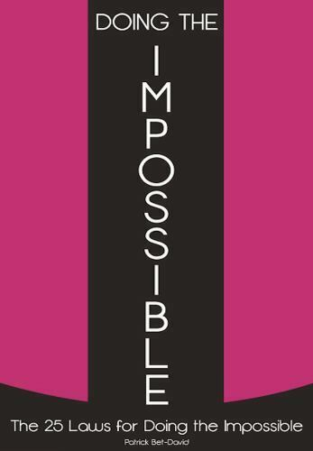

## Заметки по книге

Слушая выступления различных спикеров заметил, что люди склонны в различных ситуациях озвучивать одни и те же мысли. Часто это принципы, которыми они регулярно пользуются на протяжении жизни. Каждый раз, когда в видео или подкасте содержатся многочисленные полезные мысли, мне хочется заполучить текст сценария - из него гораздо быстрее можно сделать выжимку-напоминание.

Youtube-канал Патрика ожидаемо попал в мои рекомендации, т.к. я интересуюсь темами продуктивности и предпринимательства. В своих выступлениях автор четко излагает свои мысли, поэтому познакомиться с его книгами мне показалось хорошей альтернативой просмотру кучи видео.

В ходе чтения я рассчитывал:
1) составить список практик, которые привели автора к его результатам;
2) узнать о предпосылках, определивших образ мышления автора;
3) составить список убеждений, привычек или практик автора, которые сделали его успешным предпринимателем.

## 

